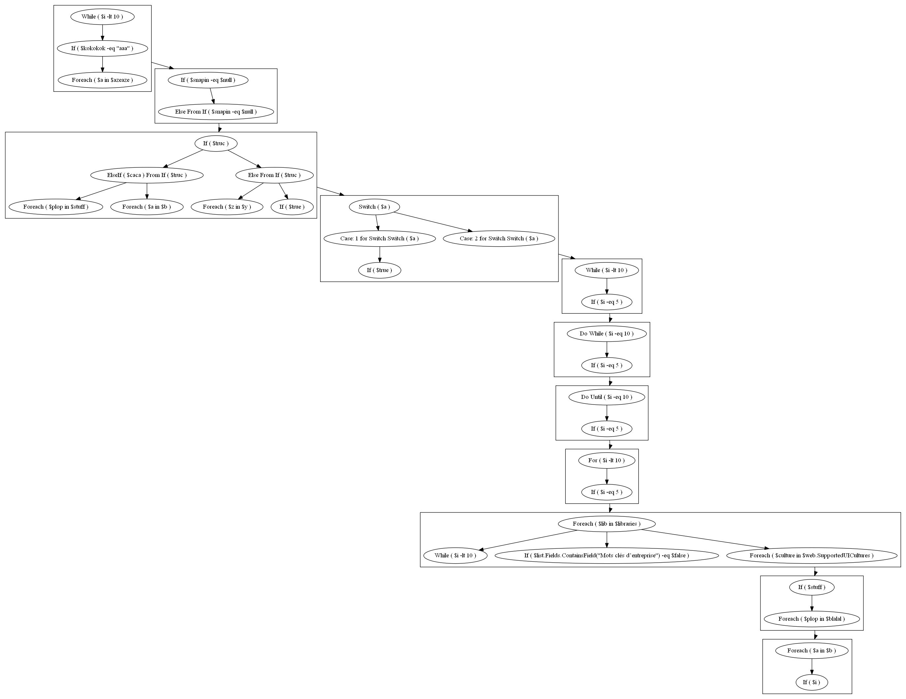

# PSScriptDiagram

This PowerShell module is leveraging Abstract Syntax Tree (AST) to retrieve the different components of your code such as variables, operators, conditional operators, loops,... in order to build a graph representation of the entire script.

## Usage

```powershell
# Parse the code
$x = Find-Node -file .\script.ps1

# Define a description for your parsed code
Set-NodeDescription -node $x

# Build diagram
New-NodeGraph -node $x -UseDescription -GroupAffiliatedNodes
```

## TODO

* RenameCmdlets
* Work on valuefrompipeline for each function
* Create a buildscript to create a unique psm1 file ... at the moment you have to load the classes then functions manually ...
* Flowchart

Here is an example of what I want to achieve:




