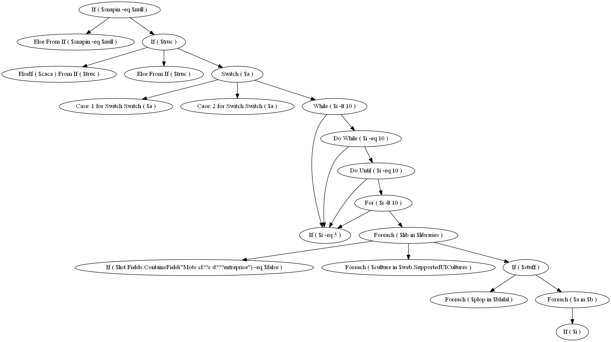

## NEED TO TRANSLATE TO ENGLISH :)
## Reminder: it's a work in progress !

# PSScriptDiagram
Idea: Fetching all ifs,loops etc ... to graph a diagram of an entire script (not a module...)


example of i what i want to achieve


# ToDO
-Fix SetDescription() method for elseifnode (maybe others ??). To test: run test.ps1, on a ``elseifnode`` the ``setdescription`` should fail..
```powershell
$path = "C:\users\lx\gitperso\PSScriptDiagram\sample.ps1"
$ParsedFile     = [System.Management.Automation.Language.Parser]::ParseFile($path, [ref]$null, [ref]$Null)
$RawAstDocument = $ParsedFile.FindAll({$args[0] -is [System.Management.Automation.Language.Ast]}, $false)

$x=$RawAstDocument | %{if ( $null -eq $_.parent.parent.parent ) { $t = [nodeutility]::SetNode($_); if ( $null -ne  $t) { $t} } }

PS C:\Users\Lx\GitPerso\PSScriptDiagram> $x[2].Children[0]                        

Type        : ElseIf
Statement   : ElseIf ( $caca ) From If ( $truc )
OffSetStart : 655
OffSetEnd   : 660
Description : 
Children    : {ForeachNode, ForeachNode}
parent      : IfNode
file        : C:\users\lx\gitperso\PSScriptDiagram\sample.ps1

PS C:\Users\Lx\GitPerso\PSScriptDiagram> $x[2].Children[0].SetDescription("test DESCRIPTIONNNNN")
Exception calling "Insert" with "2" argument(s): "Specified argument was out of the range of valid values.
Parameter name: startIndex"
At line:104 char:9
+         $this.NewContent = $this.raw.Extent.Text.Insert($f+2,$g)
+         ~~~~~~~~~~~~~~~~~~~~~~~~~~~~~~~~~~~~~~~~~~~~~~~~~~~~~~~~
+ CategoryInfo          : NotSpecified: (:) [], MethodInvocationException
+ FullyQualifiedErrorId : ArgumentOutOfRangeException

```
-Start Graph based on description
